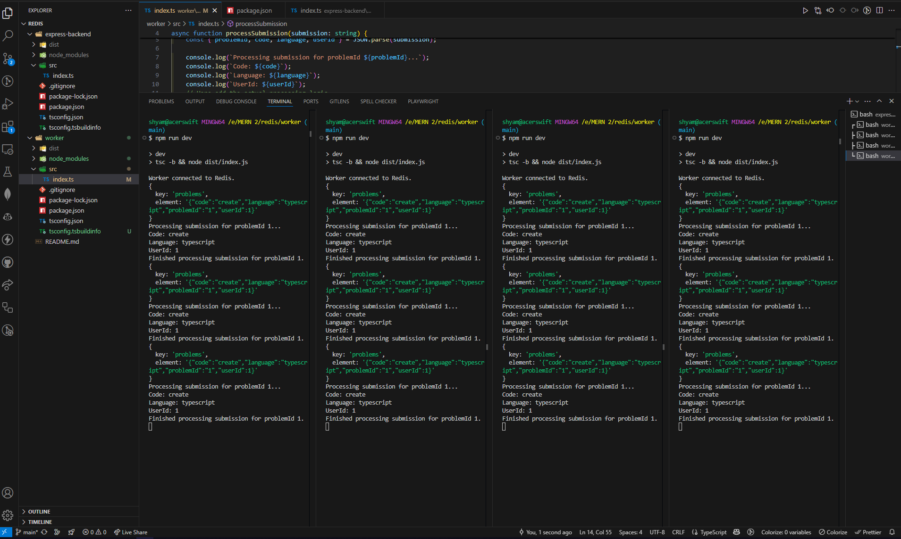

# 🧩 Express + Redis Submission Queue

This project demonstrates a clean, modular architecture for a code submission backend powered by **Express** and **Redis**. It features an HTTP API for enqueuing submissions and a background **Redis worker** that processes jobs sequentially.

---

## 🛠 Tech Stack

- **Node.js** – Runtime environment
- **Express** – Web server and API routing
- **Redis** – In-memory data store for job queuing
- **TypeScript** – Static typing and code organization
- **Docker** – Containerized Redis instance

---

## 🖼️ System Diagram

<details>
  <summary>System Architecture</summary>
  
</details>

<details>
  <summary>Screenshot 1: Redis worker</summary>
  
</details>

---

## ⚙️ Getting Started

### 1. 🐳 Start Redis with Docker

```bash
docker run --name redis -d -p 6379:6379 redis
```

To open a shell inside the container:
```bash
docker exec -it redis bash
```

To open Redis CLI:
```bash
redis-cli
```

### 2. 📦 Install Dependencies

```bash
npm install
```

### 3. 🚀 Run the Project

```bash
npm run dev
```

> This will build the TypeScript files and start the Express API or Worker based on the entry point.

Ensure you run both the **API server** and the **worker** (in separate terminals).

---

## 🔗 API Endpoint

### `POST /submit`

Accepts a code submission and enqueues it for processing.

#### 📥 Request Body(Postman)
```json
{
  "problemId": 1,
  "code": "console.log('Hello World')",
  "language": "typescript",
  "userId": 42
}
```

#### ✅ Response
```json
"Submission received and stored."
```

---

## 🧠 Worker Logic

The worker listens for new jobs from the `problems` Redis list and processes them sequentially:

```ts
const submission = await client.brPop("problems", 0);
await processSubmission(submission.element);
```

Includes:
- JSON parsing & logging
- Simulated processing delay
- Graceful handling of malformed jobs

---

## 🧪 License

Licensed under the ISC License. Built for educational and demonstration purposes.

